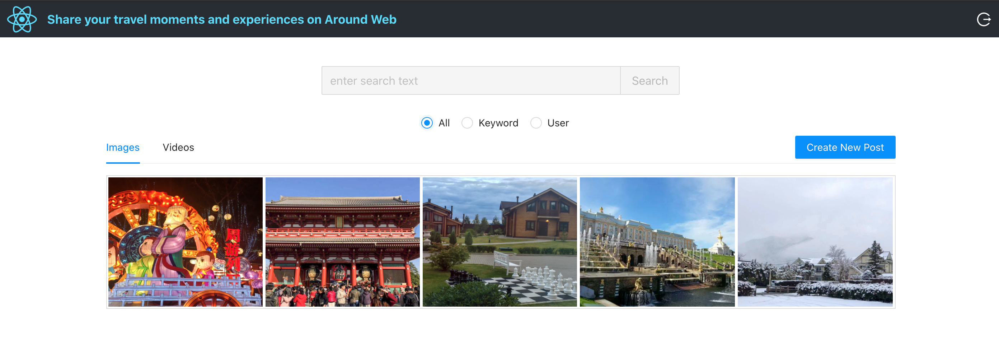

## Around 

### Description

Around is a full-stack web application for people to share photos/videos and publish posts. The frontend is built with *React*, and the backend is created using *Go*. It also supports fuzzy search powered by *Elasticsearch*.

### Project Architecture

### Technical Details

#### Frontend

* Built user-friendly webpages for users to create and browse posts and search other users' posts using *React*
* Improved authentication using token-based registration/login/logout flow with *React Router v4* and server-side user authentication with *JWT*
* Deployed to *AWS Amplify*

#### Backend

* Launched a scalable web service in *Go* to handle user posts and account information
* Used *Elasticsearch* to support searching posts based on keyword or username
* Deployed to *Google Cloud (Google App Engine)* 

 <em>Rui Zhang</em>
  Dec 10, 2021
